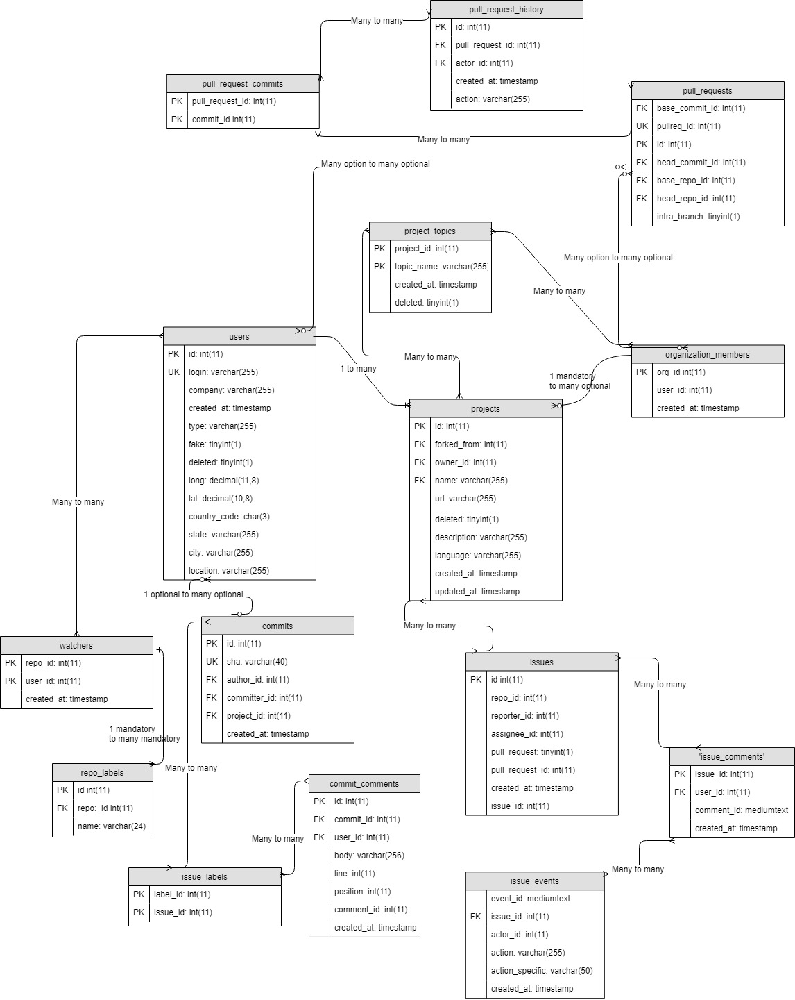
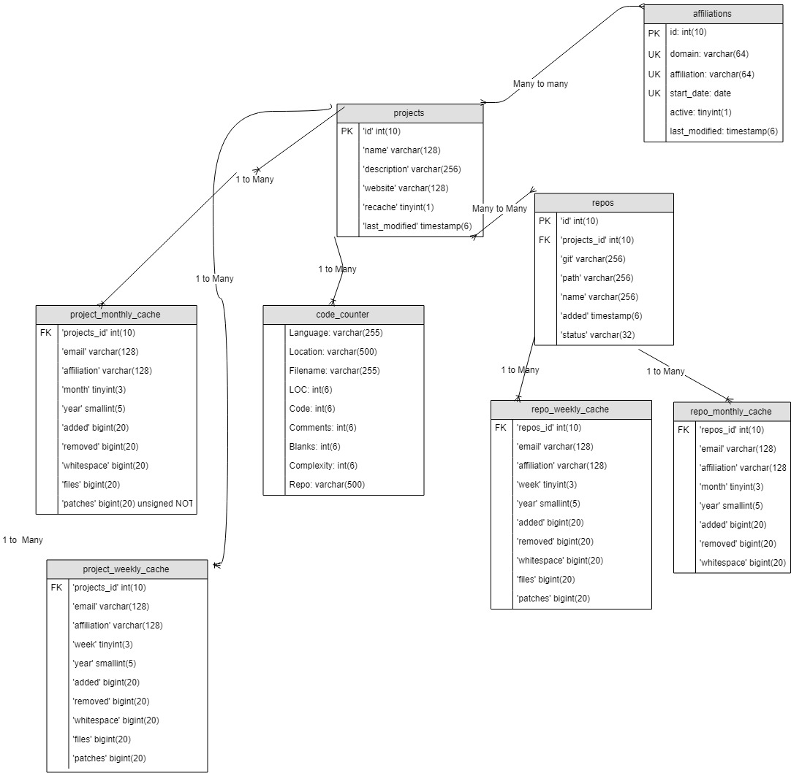

[Link to your deployment environment](http://seangoggins.ddns.net:3333)

## Functional Requirements

1. Use Case Name A
	- Functional Requirement 1
	- Functional Requirement 2
	- ... etc.
2. Use Case Name B		
	- Functional Requirement 1
	- Functional Requirement 2
	- ... etc.
3. ... etc. 

## Database Design

### ERD





### DDL 

```SQL

    CREATE TABLE "contributor_affiliations" (
    "ght_cntrb_id" int4 NOT NULL,
    "ca_id" int4 NOT NULL,
    "ca_domain" varchar(64) NOT NULL,
    "ca_affiliation" varchar(64) NOT NULL,
    "ca_start_date" date NOT NULL DEFAULT '\'1970-01-01\'',
    "ca_active" int2 NOT NULL DEFAULT 1,
    "ca_last_modified" timestamp(0) NOT NULL DEFAULT 'current_timestamp(6)',
    PRIMARY KEY ("ca_id", "ght_cntrb_id") 
    )
    WITHOUT OIDS;
    CREATE UNIQUE INDEX "domain,affiliation,start_date" ON "contributor_affiliations" ("ca_domain" ASC, "ca_affiliation" ASC, "ca_start_date" ASC);
    CREATE INDEX "domain,active" ON "contributor_affiliations" ("ca_domain" ASC, "ca_active" ASC);

    CREATE TABLE "contributors_aliases" (
    "ght_cntrb_id" int4 NOT NULL,
    "cntrb_a_id" int4 NOT NULL,
    "cntrb_canonical" varchar(128) NOT NULL,
    "cntrb_alias" varchar(128) NOT NULL,
    "cntrb_active" int2 NOT NULL DEFAULT 1,
    "cntrb_last_modified" timestamp(0) NOT NULL DEFAULT 'current_timestamp(6)',
    PRIMARY KEY ("ght_cntrb_id", "cntrb_a_id") 
    )
    WITHOUT OIDS;
    CREATE UNIQUE INDEX "canonical,alias" ON "contributors_aliases" ("cntrb_canonical" ASC, "cntrb_alias" ASC);
    CREATE INDEX "alias,active" ON "contributors_aliases" ("cntrb_alias" ASC, "cntrb_active" ASC);
    COMMENT ON TABLE "contributors_aliases" IS 'An alias will need to be created for every contributor in this model, otherwise we will have to look in 2 places. ';

%% ETC
```

## Files that are stubbed out in your repository, with comments about the use cases they are connected to. These sections may not all exist for the Zephyr project teams. Simply explain them as best you can. 

### User Interface Files

1. first one
2. second one
3. etc.


### Model Files (Database Access)

1. first one
2. second one
3. etc


### Controller Files (API or other)

1. first one 
2. second one
3. etc. 

## Describe languages you need to use, and any gaps in skills on your team. 

1. first language 
    - how you will use examples or learn what you need
2. second language 
    - how you will use examples or learn what you need
3. Skill gaps, if any, otherwise specify who is doing what
    - name
    - name
    - skill gap 

Database Design
In order for individual contributors to inspect their impact on repository scores, we would need a use case that identifies their own contributions to alternate projects. In addition, we would need the use case to allow visual representation of their repository score on projects they are working on. Furthermore, we would need the use case to calculate the individual’s impact on a repo’s score.     

In addition, we would need a use case that allows business to view consistent repo scores over  various amount of time. The use case would need to allow individuals to view the repo scores, and display the overall score based off their consistency to various projects. Furthermore, the use case would need to display the overall history of scores and provide brief descriptions of each calculation for the scores. 

Lastly, we’d need a use case for community managers to inspect a recent time frame of repo scores. The use case would also need to display the repo scores  and the overall scores over an adjustable period of time. In addition, it would need to display individual show how each stat impacts the overall score. Finally, it would need to provide a description of each calculation for the scores in each section. 

For this design we will be using multiple software components. We will be using Augur’s dependencies in order for Augur to run properly. In addition, we will use sublime text to manipulate some of the original coding that is provided in the Augur project.    

We want the Augur project to be a lot more user friendly and easier to navigate. In other words, we will also make a few changes to the homepage of Augur along with other repositories that will help satisfy the requirements of our use cases for different users.
